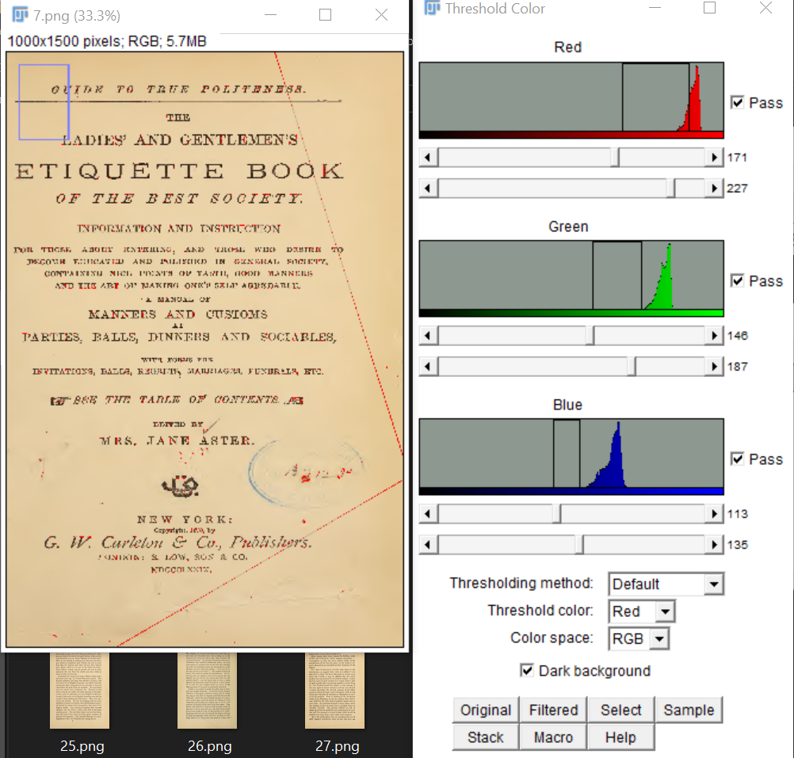

# Observation

I got spoiled on this one and knew you had to fold the page according to the creases on the pages.

Still wanted to write the code myself.

got it working will comeback to properly threshold it.

going to try to single out rgb(187,164,122) and got this -> 

